# Welcome to my "Blog" CTF walkthorugh!
You can find this CTF and many more on https://tryhackme.com/

## Self note:
In order to make this walkthrough as practicall as possible,
I added only the relevant pictures and explenations, in order to make it straightforward.

## 🔎 Reconnaissance

I started this CTF with a regular Nmap scan, in order to get a snapshot of what I'm going to be dealing with.

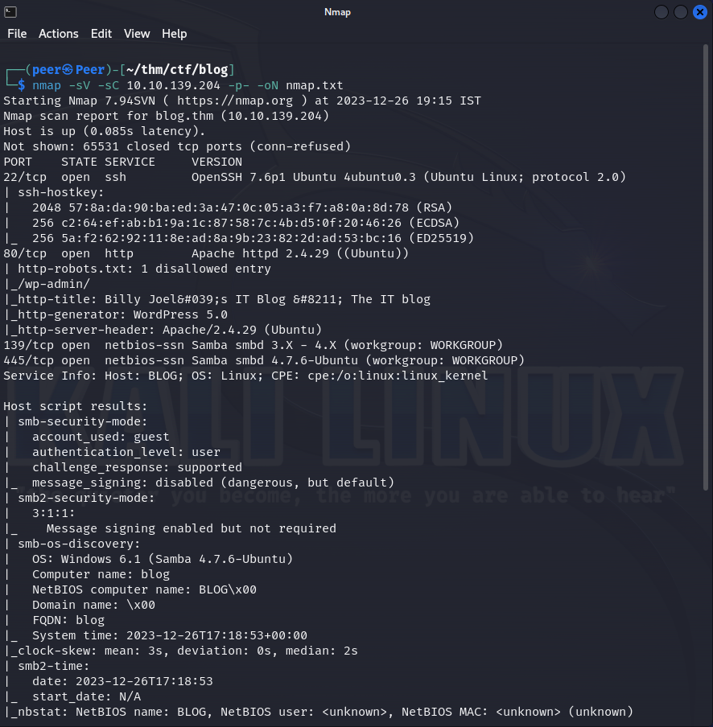

As we can see, we have couple interesting ports, on port 80 we got a webpage (wordpress) and his version.
On port 139 and 445 we have SMB service, (tip: on linux SMB called "Samba", this is one way to know what is your target's OS).
  
So lets take a look on the webpage.

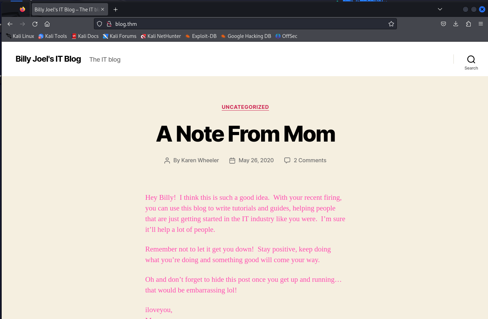
 
As we can see, there is kind of a blog and we can see two authors, one is "billy Joel" and the second is "Karen wheeler".
  
Let's anumerate this blog further, and run GoBuster.
 

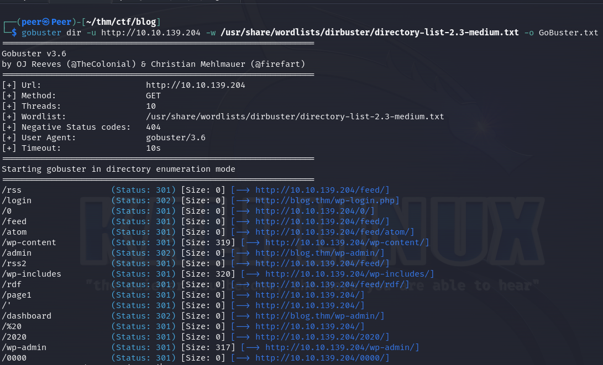
 
We can see some interesting folders.
  

## Credentials harvesting 🧰
We found a "/wp-admin" that redirect us to a login form (also found in the website itself), and tried to enter a default username.

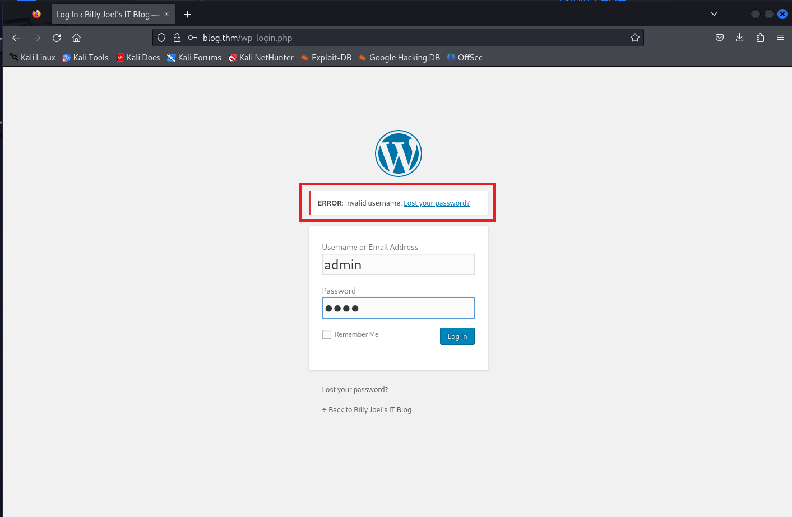
 
In this case I tried "admin" just for the check, and the login page disclose us that this is invalid username.
 
Can we brute force it in order to find a valid one?, sure.
 
but why work harder when we can work smarter?, For now I'll leave it here and move to enumerate the SMB shares just in case...
  
I used "SMBmap" for this job.

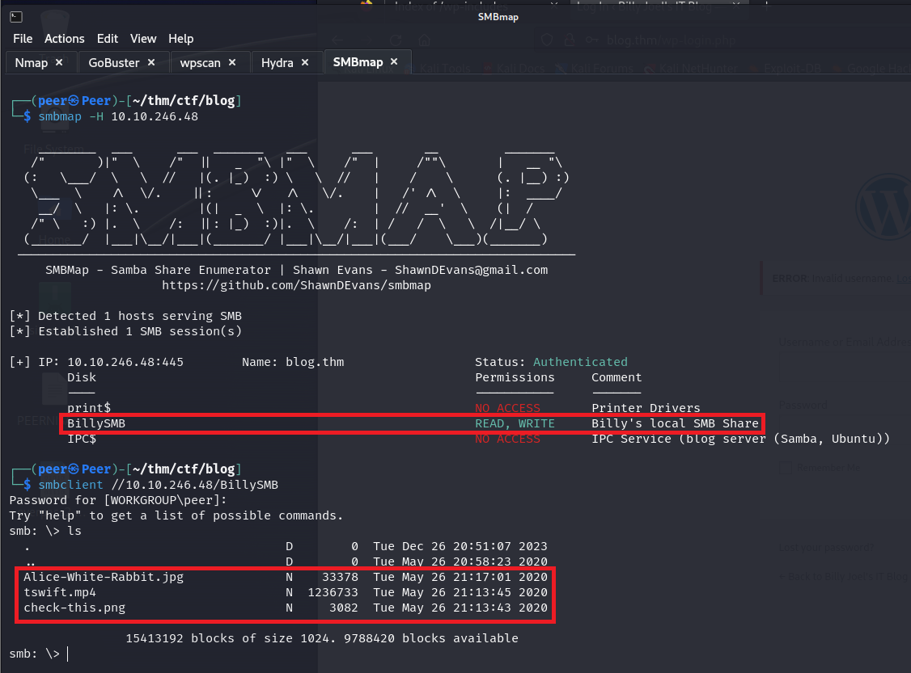
 
And we can see a share with read and write permissions, but this is a rabbit hole, there are some memes and a steg file of a picture that tell us we fall into the hole 😆.
  
Another tip, we can also enumerate SMB shares with Nmap as you can see below.

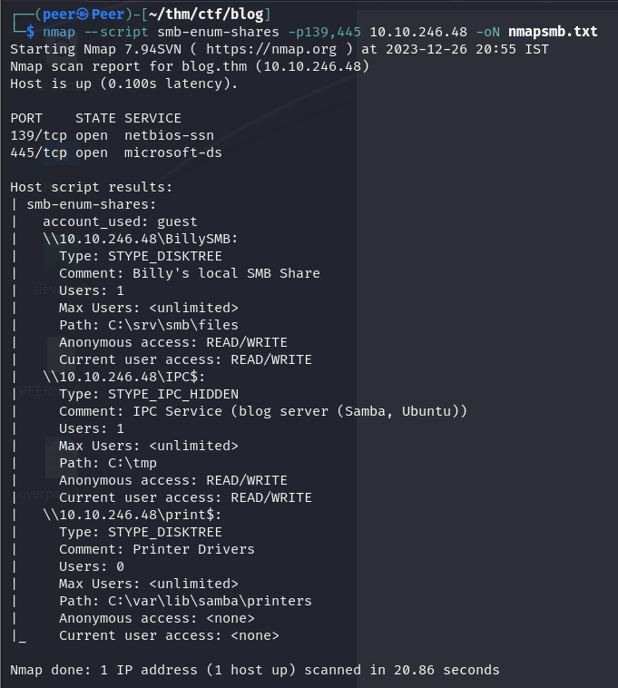
  

Ok, let's get back to the username enumeration, I told you we can work smarter so I'll show you how.
 
First we have a tool called "WPscan" that know to enumerate a lot of important things of wordpress sites.
 
I found an important upload folder and the two authors from before, furthermore, their usernames.
 
Billy Joel is bjoel and Karen Wheeler is kwheel.
  

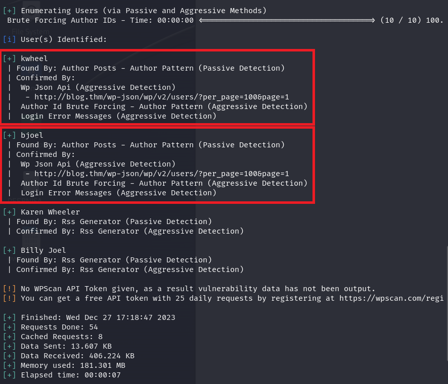

I know you waited, so <b>anoter</b> tip!
 
On some versions of wordpress, there was a vulnerability that disclose us all the users on the website.
 
The way to use it is: site.com/wp-json/wp/v2/users
 

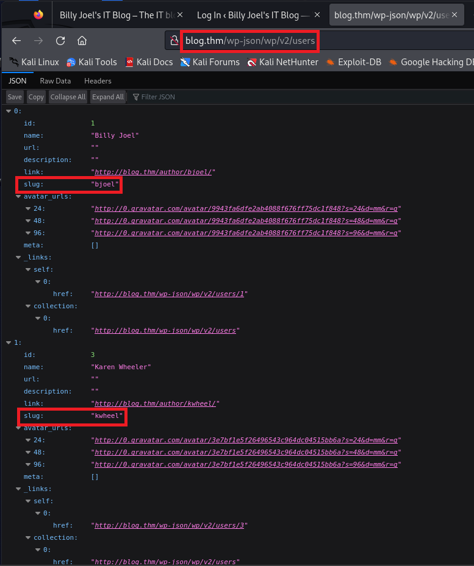
 
Cool, isn't it?
  

Let's brute force the login page with the credentials we have so far.
 
Let me tell you that bjoel not intended to be hacked, but his mom (kwheel), do.
 
I captured a request with burp suite in order to see the parameters I need in order to perform the brute force.
 

## Brute-force 🐉
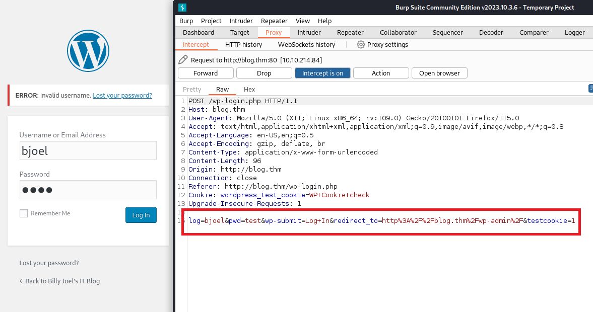
 
I also added for you the login page when we trying to enter a valid username.
 
Notice how the login form tell us which user exist and which not.
 

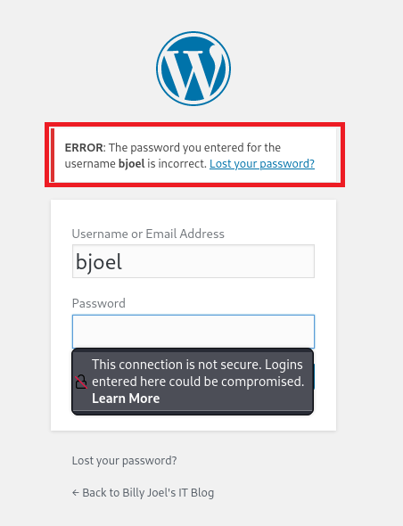
  

Here I tried to Hydra those users:
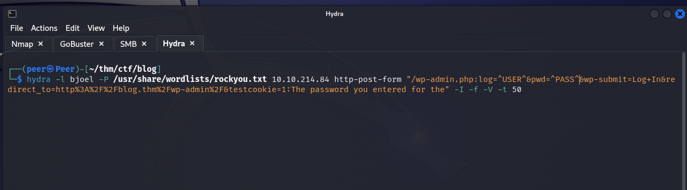
  
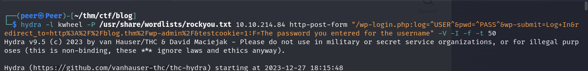
  
And this is the cracked password of kwheel:
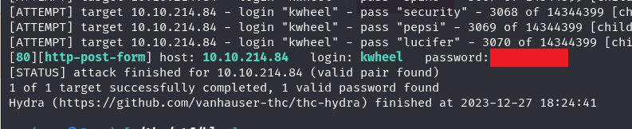
 

## Exploiting vulnerabilities 🔓
We know that the wordpress version is 5.0, let's search for vulnerabilities, I uses searchsplit and exploit-db.
 
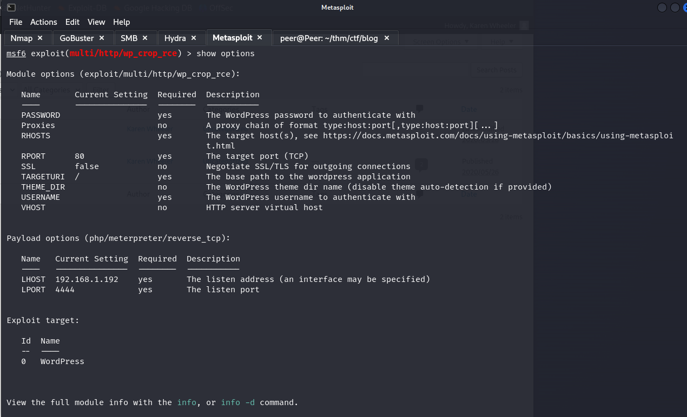
  
Then I found RCE vuln using Metasploit, and filled the relevant parameters.
  
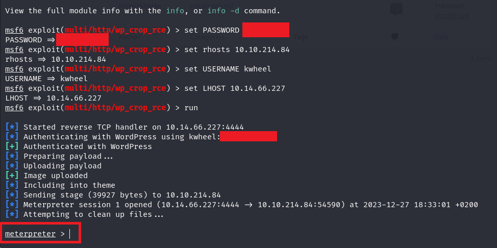
 
We got a shell! 🚀
  

## Got a shell 🐚
Short visit in on the file system and we can found the user.txt, but this is another rabbit hole.
 
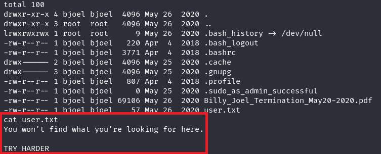
 

I found a suspecious USB in the /media folder but only Billy and Root can watch the content 😢.
 
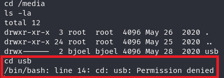
  

This means we have to perform lateral movement or escalate our privileges, so I started with my regular rutine of enumeration for PE vectors.
 

## Privilege Escalation 👑

As you can see below, I found a strange SUID, with root, runs on root privileges, awsome.
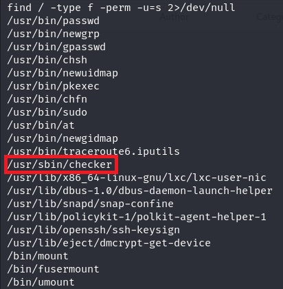
 
But what is this binary intended to do?
 
After analysing this binary, I found she is search for env variable called "admin" and checks for his value.
 
I want to make my explenation clear so I broke it down to four stages:
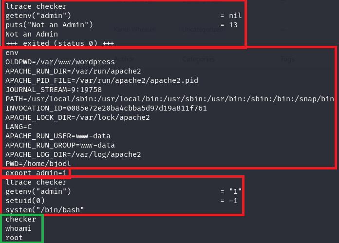
  

<b>Stage one:</b> I used the "ltrace" command that helped me to analyse the binary and what it searching for.
 
<b>Stage two:</b> I used the "env" command to check my environmental variables, but no "admin" there.
 
<b>Stage three:</b> I added a variable and set it to 1 (one means true).
 
<b>Stage four:</b> Now I checked the binary with "ltrace" again and watch what happened when I run it.
  
<b>We are root!🥇</b>
  

Let's check our flags on /media/usb/user.txt and /root.txt.
 
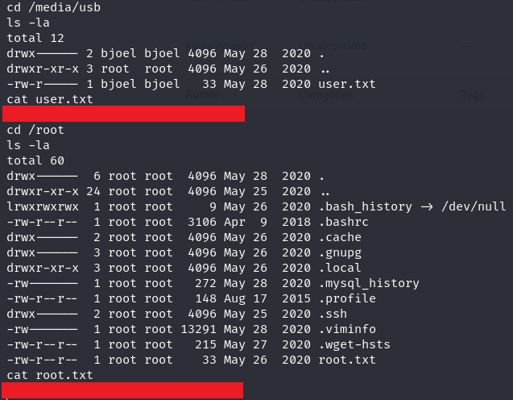

## Thank you for reading my walkthrough!

