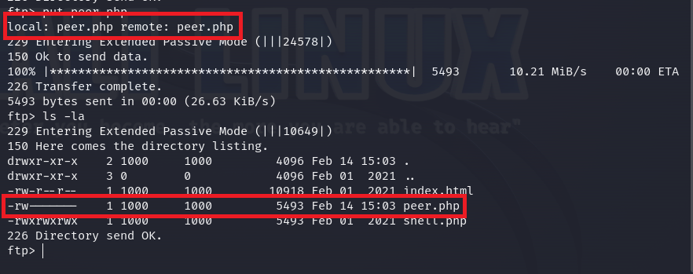

# Welcome to my "H4cked" CTF walkthorugh 💻!
You can find this CTF and many more on https://tryhackme.com/

## Self note:
In order to make this walkthrough as practicall as possible,
I added only the relevant pictures and explenations, in order to make it straightforward.

## Questions 1&2❓

On the first question you should only read the task ✅
 
In the second question we asked to find which service the attacker tried to attack,
 
So let's open the ".pcap" file we got:
  

  

A little brief and we can see the service has been attacked by the hacker,
 
And the answer for the second task is "FTP" ✅
 

## Question 3❓

On the third question we asked to find the tool which used by the hacker,
 
Google it!
  

  

The answer for the third task is "Hydra" ✅

## Questions 4&5❓

Now they asked us to find which user the hacker tried to hack and what is the password.
 
Take a look at the .pcap file again:
  

  

As we can see the username is "jenny" and now we can answer question number 4 ✅
 
But what is the password?, in order to find the password let's take another brief and follow the TCP stream:
  

  

It can take a while but for experienced users it can take up to 2 minutes so take it easy.
And we can answer the fifth question (password123) ✅

## Questions 6&7❓

On question 6 we asked to find the current FTP working directory,
 
Again, follow the TCP stream on the further part of the .pcap file:
  

  

As you can see, the current working directory is "/var/www/html" and now you can answer question number 6 ✅
 
In addition you can see the answer for question number 7, the backdoor's name is "shell.php" ✅
 

## Question 8❓

In order to answer question number 8, I sorted the packets from the biggest to the smallest,
 
I knew that the shell should be bigget than the other packets and found it in the first place,
 
and then examined it:
  

  

You can see within the file, that there is a link to the creator's website and this is the answer:
 
"http://pentestmonkey.net/tools/php-reverse-shell", now answer question number 8 ✅

## Questions 9-14❓

Ok, now we know that the attacker uploaded a webshell, and we have to try and find when he executet it,
 
so find the correct place (about the buttom of the .pcap file when there are a lot of TCP packets),
 
and follow the TCP stream, that reveals us a lot of answers:
  

  

First, you can see the first command the attacker executed after getting his reverse shell "whoami",
 
and now answer question number 9 ✅
  
In addition the host name "wir3" and the TTY command "python3 -c 'import pty; pty.spawn("/bin/bash")'",
 
Now answer question number 10 and 11 ✅
  

When you trying to scroll a little, you will notice the answers for questions 12 and 13:
  

  

In order to get a root shell, the attacker simply executed "sudo su", then he uploaded a malucious file called "Reptile",
 
this file is a backdoor type that called "Rootkit", this is type of a backdoor that very hard to detect and can hide itself
 
in order to keep itself on the system and stay undetected.
  

So, the answers are:
 
12: "sudo su" ✅
 
13: "Reptile" ✅
 
14: "Rootkit" ✅
  

## Questions 15&16❓

On task 15 we just have to read what they have to say about the attacker ✅
 
But on task 16 we have to run a brute force attack with "Hydra" on the FTP service in order to gain access to the machine.
 
Easy...
  

  

So I knew the username is "jenny" but the attacker changed his password...
  

  

Now we also know the password and can answer question number 16 ✅
 

## Question 17❓

Now we have access to the FTP server, and that means we can add a shell or edit the current shell,
  

  

So I used the same webshell (copied from pentest monkey's github), and just changed the relevand variables:
  

  

Then I uploaded the shell to the FTP server:
  

  

But don't forget to change the permissions, otherwise, the webshell won't work!
  

  

In addition, don't forget to check question number 17! ✅

## Questions 18-20❓

Simply set up a listener on the same port you wrote on the .php webshell, and search the file in the browser:
  

  

Now we can also check question number 18! ✅
  

The last two questions is about becoming a Root and read the flag, but this is the easiest part, because:
 
1. Maybe we are "www-data" but we know about the user "jenny".
 
2. We know jenny's password, it is the same password for the FTP server.
 
3. We know that jenny has sudo permissions for all of the commands(Including "sudo su")!
  

  

So, we answered questions 19 and 20 and finished the CTF!
 
Hope you enjoyed and maybe learned something new!

## Thank you for reading my walkthrough!

