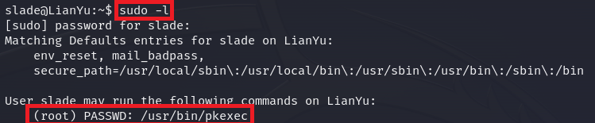

# Welcome to my "Lian_Yu" CTF walkthorugh ⛰️!
You can find this CTF and many more on https://tryhackme.com/

## Self note:
In order to make this walkthrough as practicall as possible,
I added only the relevant pictures and explenations, in order to make it straightforward.

## Reconnaissance🔎:
As every CTF, we starting with recon, so let's run Nmap and some other tools as needed:
  

  

I checked the HTTP server, but the Index.html is not very interesting (feels like waste of time😆).
  

  

But don't forget that on the tasks, we have a question about a web directory, so I used GoBuster for this mission.
  

  

As you can see, Gobuster found a directory called "island" but this is an incorrect answer...
 
Let's try to access it anyway:
  

  

There is a hidden code word, (I found it without access the source code, as a rule I always click and drag websites😆),
 
But I'll show you how it looks like in the source code:
  

  
Note the h2 header, its color is white, and the hidden code word is "vigilante".
 

Yet, we don't have any answer for the second question...
 
That means we have to enumerate further:
  

  

We found another directory, called "2100", and this is the answer for the second question! ✅
 
Let's try access to the /island/2100:
  

  

Nothing interesting, but let's take a look on the source code just to be sure we don't miss anything:
  

  

This is a clue for us to try and search for a file with ".ticket" extensiton.
Luckily, GoBuster can handle it well with the -x flag:
  

  

After couple minutes, GoBuster found the file "green_arrow.ticket"
 
Now we can answer the third question ✅
 
So let's navigate there:
  

  

## Decode the hidden password🔓:
We can see a message with sort of a password or maybe encoded something...
So let's check if its really encoded:
  

  

As you can see, this is really an encoded message (encoded with base 58) and maybe this is the password for the FTP service?
 
Actually this is the password for the FTP and now we can answer the fourth question! ✅
  

## Access the FTP server📂:
Until now I've found a code word (vigilante) and a password for FTP (!#th3h00d).
 
Now I want to look what inside the FTP server using the credentials I found and maybe reveal something new.
  

  

I downloaded all the files from the /home/vigilante and kept enumerate the machine a little...
 
When I navigated the the /home and listed the directories, I've found another user called "slade":
  

  

## Stego🐊:
Ok, now I want to examine the files I've downloaded from the vigilante's home directory,
 
I think there is some hidden files within them...
 
So I started to use some tools in order to check it (strings, file, steghide, binwalk and others...),
 
I can tell you that the only file that should interest you is the "aa.jpg", there are two files within.
 
But first, let's extract the files:
  

  

As you can see, we have to enter a passphrase in order to extract the files, but I found a tool called "stegcracker" that can do the job for me!
  

  

And we successfully cracked the password!
 
So let's extract the "aa.jpg" again with the password "password".
  

  

Note that the extracted files are actually a .zip (ss.zip), so I unzipped it.
 
Then you can see the actuall files, "passwd.txt" and "shado".
 
By the way, "shado" is the answer for the fifth question ✅
 
Its also a clue, because "passwd.txt" sounds like the /etc/passwd (a linux file that contains all the users in the system),
 
And "shado" sounds like /etc/shadow (a linux file that contains all the passwords (encrypted) for the users in the system).
 
So we can assume that the shado refes to the password.
  

  

Remember earlier, when I listed the /home directory in order to find some other users?
 
So now you'll understand why:
 
I tried to SSH vigilante, but unseccessfully...
 
On the other hand, I know I have a valid password, but for who and how should I know about the other user?
 
But luckily we are smart enough to check those basic things!
 
So, lets SSH slade!
  

  

## SSH slade💻:

First, lets read the most important thing, the "user.txt" and paste it as an answer! ✅
  

  

Note that we have a strange file in the /home/slade, the ".Important":
  

  

## Rabbit hole🐰:
They want us to find a file called "Secret_Mission", actually I immediately knew it was rabbit hole...
 
But why not?
  

  

As I told you, just lorem ipsum (and waste of time😆).
  

## Privilege escalation👑:
So, let's do it in my way (as a kill chain and not as a story):
  

  

Wow, in the first try, in just a simple "sudo -l" we found a binary called "pkexec", let's see how we can exploit it:
  

  

Ok, so GTFObins gives us a command to run as sudo, let's try:
  

  

We rooted this machine, hope you learned something new, and most importantly enjoyed!

## Thank you for reading my walkthrough!
