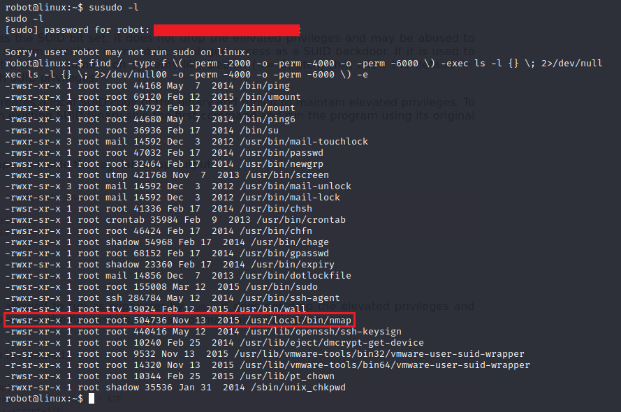

# Welcome to my "Mr. Robot" CTF walkthorugh 🤖!
You can find this CTF and many more on https://tryhackme.com/

## Self note:
In order to make this walkthrough as practicall as possible,
I added only the relevant pictures and explenations, in order to make it straightforward.

## :mag_right: Reconnaissance:
So, the firts thing to do In almost every CTF is to scan the network we are deal with.
In this case I used Nmap.
  

  
As you can see we have two intresting ports (80 and 443), that means we probably have a website there.
    
Let's check the Robots.txt file (I recommend to check it as a rutine).
  

   
As we can see we have two things here.
 
One is the first key 🔑 and the other is a dictionary.
 
As a tip, this dictionary includes a <b>lots</b> of duplicates so I'll give you a command to sort them well.
  
<b>"sort -u your_file.txt -o your_file.txt"</b>
 
-u = uniq
 
-o = output
  

   
So let's investigate the website further, I used gobuster as you can see:
  

  
We can see the "wp-admin" and "wp-login", basically these pages refering us to the same location (wp-login).
 
There are some common vulnerabilities within wordpress and the one I want to check is the username disclosure.
 
When we trying to enter a username, the login form telling us if the username is valid or not.
  

## 🔓 Credentials harvest and Brute-Force:

   
Let's brute force the login form with usernames and find a valid one.
 
In this case I used the dictionary from earlier.
  

   
So we have found the username, In order to find his password,
 
I tried the same dictionary but changed the values on Hydra according to the error message:
  

   
And this is the output of the brute force:
  

   

## Get a shell 🐚
(To be honest, I forgot to take screenshots of the next little stage so I'll explain it by words 😆):
 
So after we have logged in the account, we can see the "Appearance" tab on the dashboard,
 
Then, navigate to the "Editor" sub-tab, and select the "404.php" on the right side.
 
What we trying to do is to make the website run our script (that we put within the middle of the page),
 
everytime the selected page loads.
 
So, I removed the content on the 404.php error message, and instead insert a php reverse shell.
 
As a result, everytime the website will have to run a page that does not exist, the payload will run.
   

So, let's setup a listener and catch our shell:
  

   
In the /home/robot we can see two files, one is another key, and the other one is a md5 password for the user "robot".
  

   

## 🔓 Lateral Movement & Password Cracking:

The second key has a read permissions of his owner (robot), so we cannot watch the content of this file.
 
So, let's crack this password in order to watch the content of the second key.
  

After I got the password for robot, I've SU to robot and got the second key 🔑.
 
(you cannot see the second key in the picture because someone forgot to screenshot it 😆)
  

   

## Privilege Escalation 👑
Now, When we have a foothold on the machine, the last flag would probably be in the /root folder,
 
Let's investigate some privilege escalation vectors:
  

   
I tried to check if the robot user has some sudo commands but there are no sudo command for him,
 
But then I tried to check for some SUID, and I've found an intresting SUID (nmap).
  

  
On GTFObins, we can see that nmap with SUID can give us an interactive shell as the owner user.
  
In this case the owner is root, so let's run this SUID.
  

   
And we rooted this machine.
 
Search in /root and we can see the third key 🔑
  

## Thank you for reading my walkthrough!

