# Welcome to my "Res" CTF walkthorugh 💻!
You can find this CTF and many more on https://tryhackme.com/

## Self note:
In order to make this walkthrough as practicall as possible,
I added only the relevant pictures and explenations, in order to make it straightforward.

## Reconnaissance🔍:
First of all, I run Nmap scan in order to check for open ports.
  
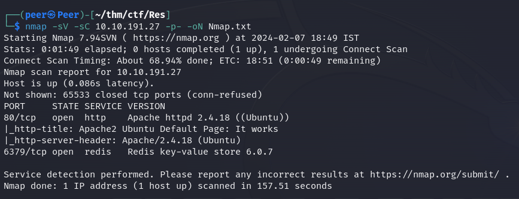
   

As we can see, we have two open ports(80, 6379) and now we can answer the first four questions!
  
1: 2
 
2: redis
 
3: 6379
 
4: 6.0.7
   

Let's enumerate further:
 
Nmap can scan the redis server and give some more helpful info:
  
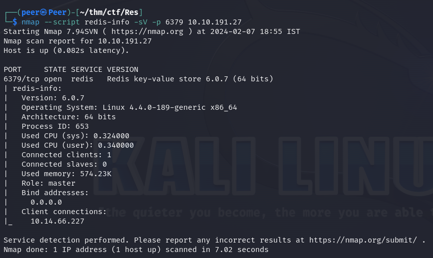
   

In addition I checked the HTTP server at port 80 but this is just the default page of Apache...
  
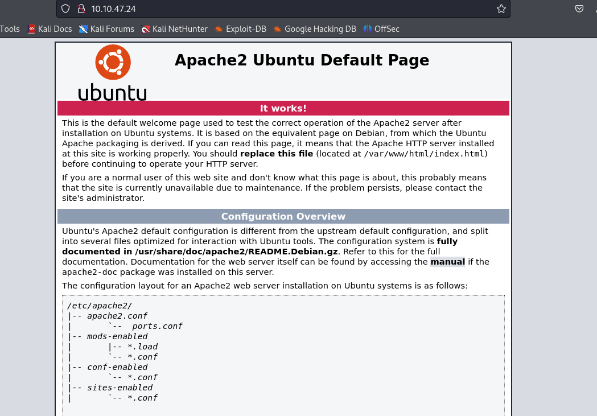
   

So I decided to run a GoBuster scan in order to search for hidden pages:
  
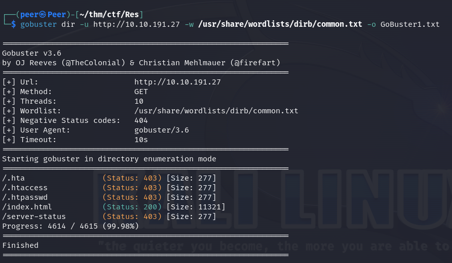
   
Nothing interesting...
  

## Redis Exploitation🔓:
I don't know the Redis database like I know SQL's so I decided to search some information on the interner first...
 
I found a some websites for Redis exploitation but I want to recommend on "Hacktricks" that provide a lot of information about services and exploitation methods.
 
I tried to enter the Redis DB and found that there is no authentication...
  
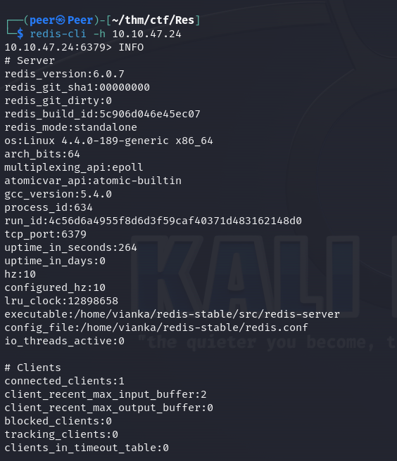
   
Then I found that I can create a webshell and use it within the HTTP server from earlier.
  
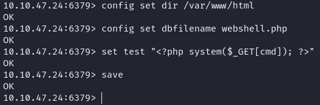
   

I've tried to test it and the webpage really returned me the correct output.
  
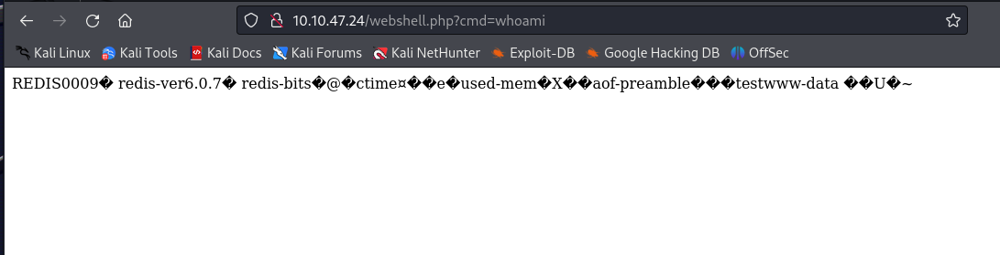
   

## Getting a shell🐚:
So now, when we know we can run arbitraty commands, lets get a reverse shell!
  
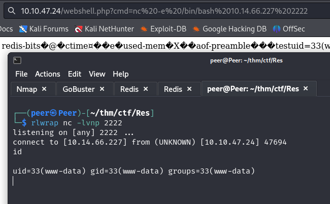
   
I provided with the "www-data" user and checked the /home directory.
 
In Vianka's home directory I found the "user.txt" flag.
  
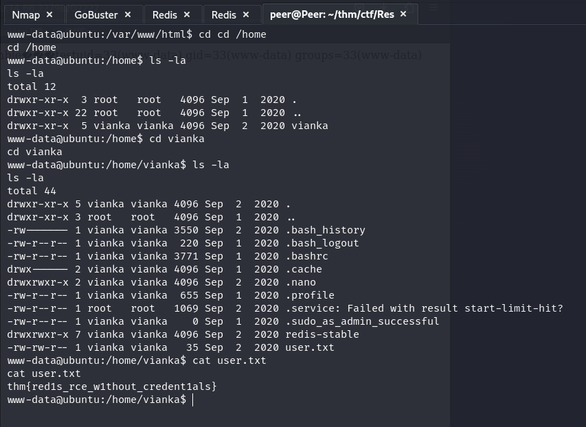
   

## Privilege Escalation💪:
Now we want to get her user, and perform a lateral movement.
 
So, I manually enumerated for privilege escalation vectors.
 
I found an unusual SUID called "XXD" with the Root's permissions, so I checked on GTFObins what it can do.
  
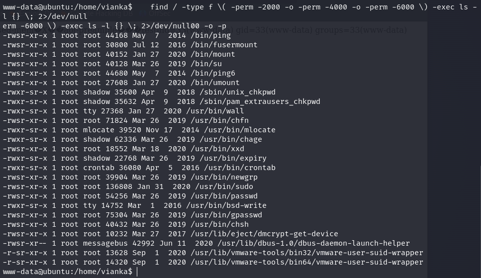
   

It turns out that misconfigured SUID permissions on this binary can lead to sensitive file reading so I decided to read the /etc/shadow file,
 
and succeed!
  
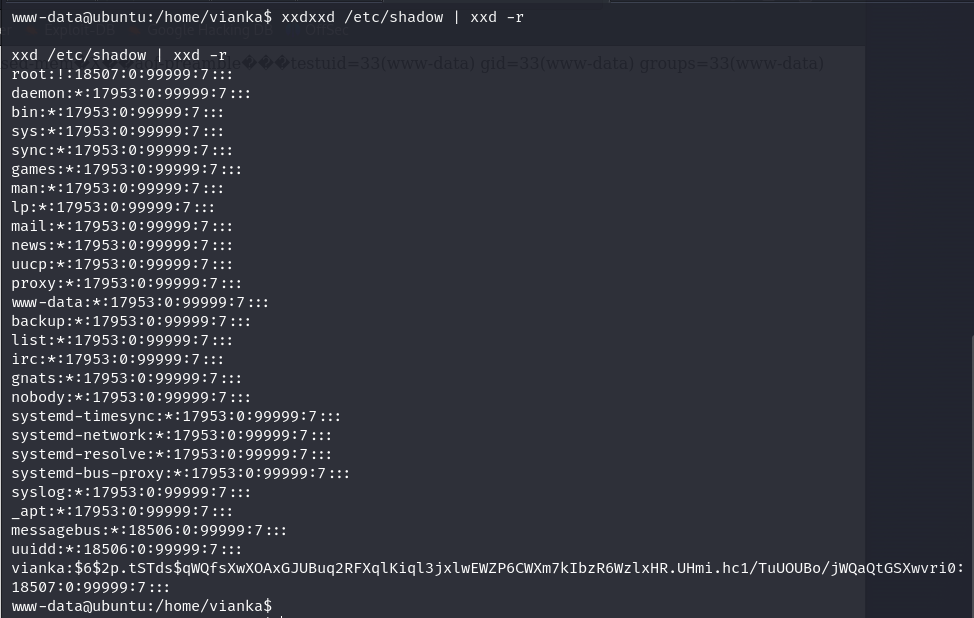
   

If I can read the /etc/shadow I can combine it with the /etc/passwd and further crack it with tools like JTR.
  
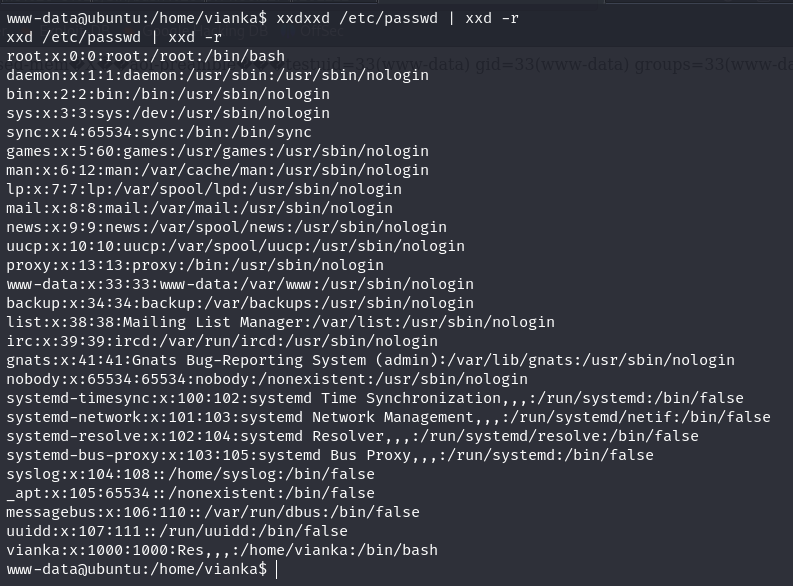
   

Here I copied the two relevant fields on both files and entered the /passwd to a file called "user.txt" and the /shadow to a file called "pass.txt".
 
Then I unshadowed them to a one file and user JTR in order to reveal the password.
  
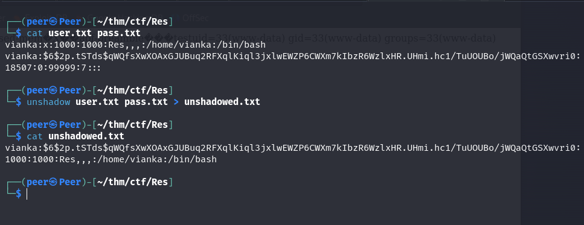
   
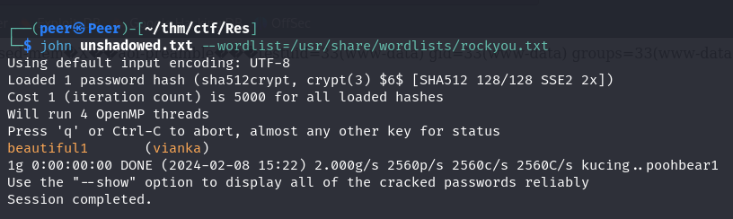
   

##Being Root👑:
I switched the user to Vianka and start looking for privilage escalation vectors again.
  
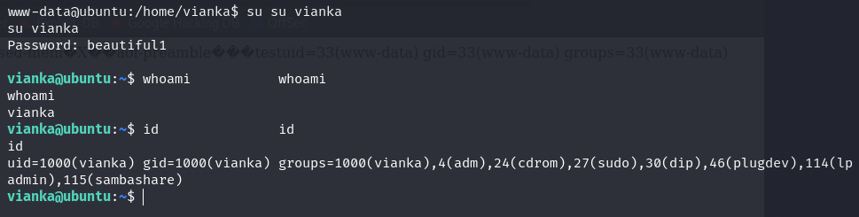
   

Note that when I run the "ID" command, I was able to see that Vianka is in the "Sudo" group, what means that she probably can run some sudo commands.
 
I checked that with "sudo -l" command and I had her password, so it's not a problem.
  
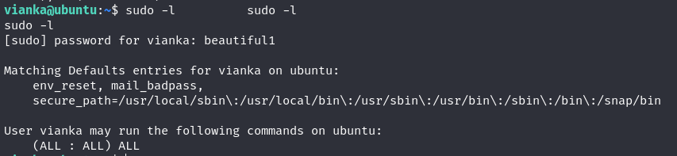
   

Vianka in a big problem, she doesn't know how to configure permissions and she has a fully sudo rights, so I switched to Root easily!
 
Note how she has (ALL : ALL) ALL.
  
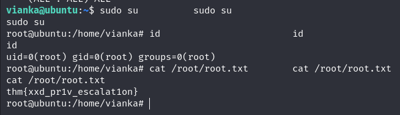
   

Thats it, now we can see the "root.txt" flag and finish the CTF!

## Thank you for reading my walkthrough!

