# Welcome to my "Year of the Rabbit" CTF walkthorugh 🐰!
You can find this CTF and many more on https://tryhackme.com/

## Self note:
In order to make this walkthrough as practicall as possible,
I added only the relevant pictures and explenations, in order to make it straightforward.

## Reconnaissance🔍:
First of all, I run Nmap scan in order to check for open ports.
  
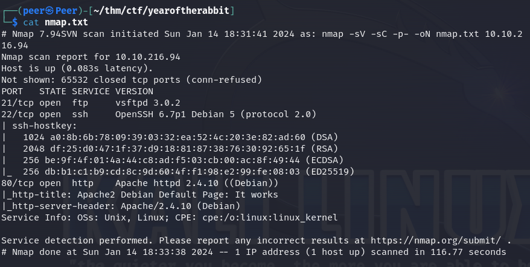
   

As we can see, we have 3 different ports.
 
21: FTP
 
22: SSH
 
80: HTTP server
  
So I first checked the HTTP server.
 
But there is nothing there, the service is running, and the index.html is the default apache banner.
  
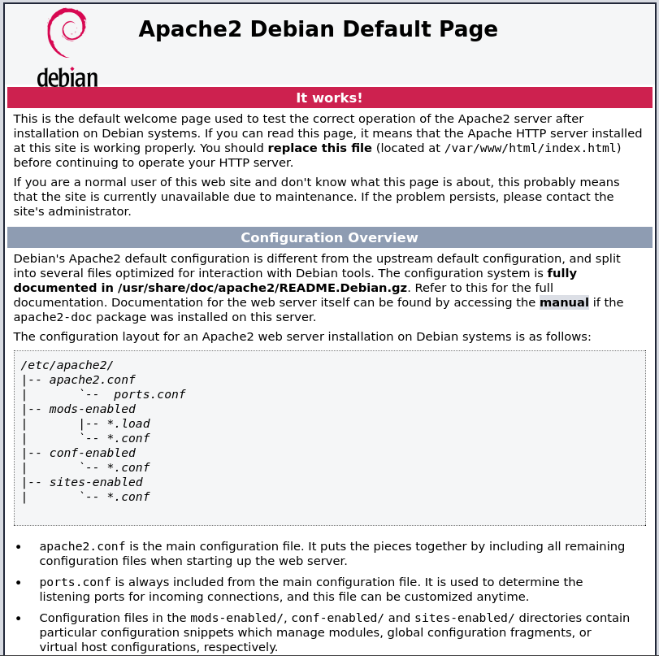
   

But if the apache is on, so probably there is a folder, so I treid to enumeratre it with GoBuster.
  
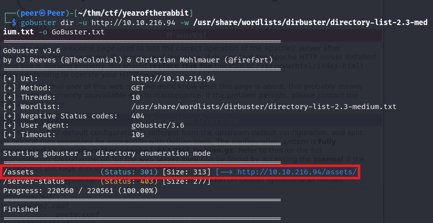
   

And as we can see, there is a folder called "/assets", so I've navigated there.
  
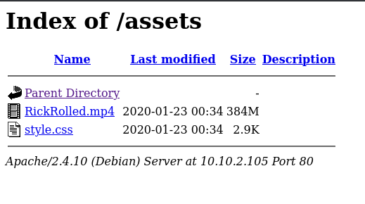
   

This page listed me two files, one is kind of rabbit hole, and the other is a stylesheet.
 
At this point I was stucked, but after couple minutes I've noticed two things:
 
1: There is a voice message within the .mp4 file, that says something like "this video is a rabbit hole (burp) you are looking in the wrong place".
2: In the stylesheet, there is a comment as you can see below:
  
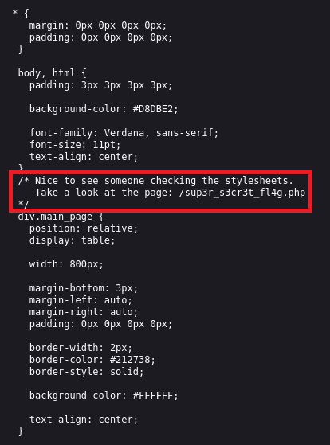
   

Intresting, let's navigate there.
 
In this page there is a message that tells us to turn off the JavaScript, so I did so,
 
(otherwise the page will redirect you automatically to a youtube video).
 
And inside the page, there was the same video from "/assets", with the same burp 😆,
 
So I understood that I might need to use Burp Suite.
  

## Traffic Interception🛑:

After I've intercepted the traffic I noticed this:
  
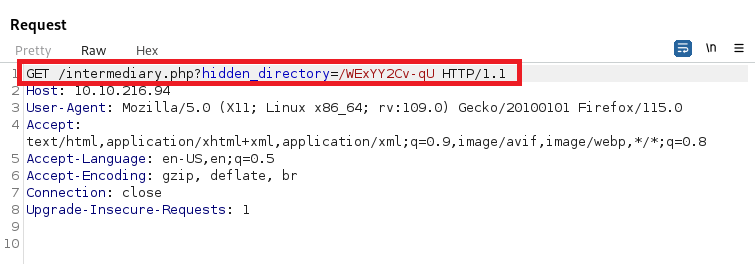
   

There is a hidden directory within the request, so I checked it.
  
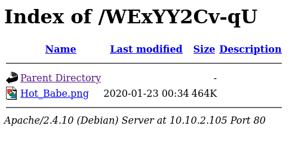
   

## Hidden content🦖:
When I've seen this I immediately understood that this is a steg file (a file that have hidden files within),
 
In the picture I used "strings", strings is a Linux command to check the strings within a file.
  
I want to help you further and list you two different ways to analyse such file:
 
1: strings <file>
 
2: binwalk -e <file>
  
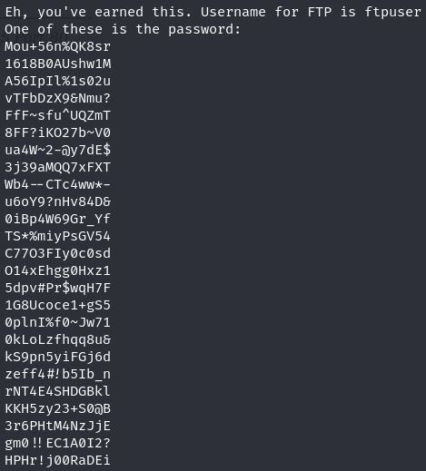
   

At some point, I've noticed a message "Username is ftpuser, One of these is the password:".
 
So I made a "ftppass.txt" with all of the passwords under this message.
  

## Brute-Forcing FTP🔓

I used the "ftppass.txt" with the username "ftpuser" and let hydra to do the job.
  
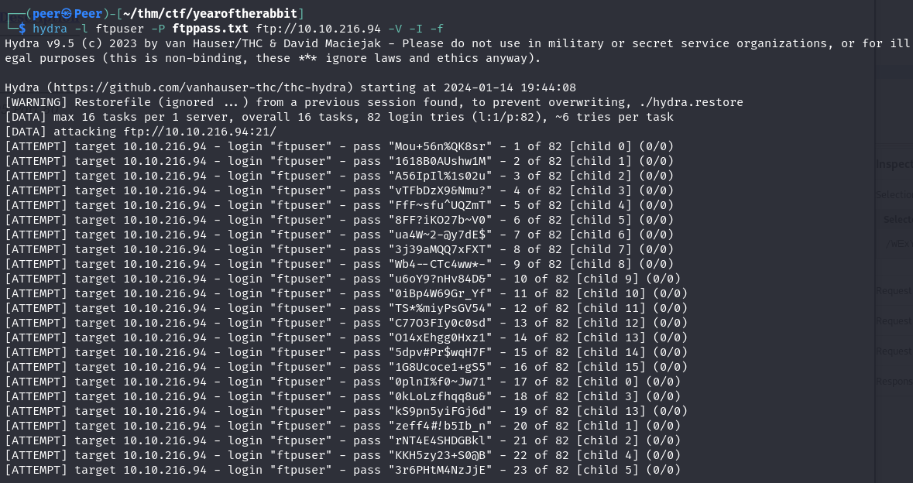
   

Hydra found the password (although I didn't took a screenshot of the pass😆) and I've logged in to the FTP service.
  
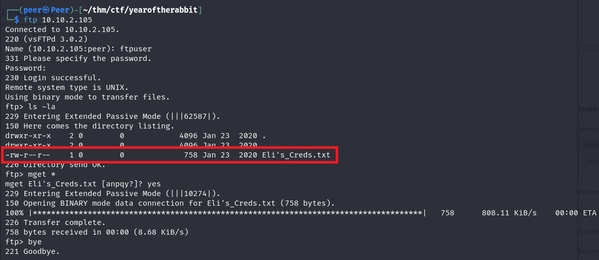
   
Apart from the "Eli's_Creds.txt", there is nothing intresting there, (but now we know one of the user's name).
 
I used cat on this file and:
  
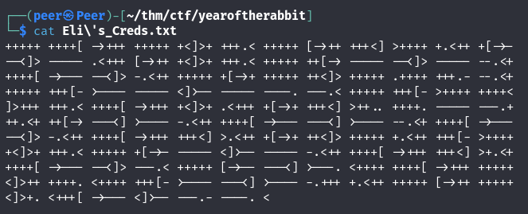
   

I tried CyberChef but it's not recognised this encoding method.
 
But after a little search I've found that this endoing method called "BrainF*ck".
 
So I've searched for decoder and the username and the password actually was there.
  
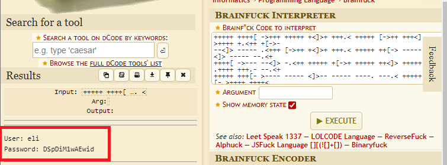
   

## Get a shell🐚

After I had the username and the password, I tried to log in the SSH service,
 
When I managed to do so, I noticed a login message (also called "motd", stands for "message of the day"),
  
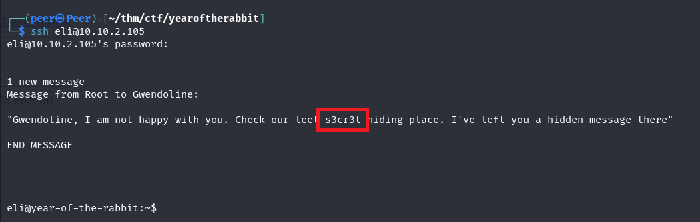
   
Root tells Gwendoline about a secret place (probably a directory), At first I didn't pay attention to the message.
 
Then I found in the /home a user called gwendoline with the "user.txt" inside.
 
Guess what? I didn't had the permission to read the file.
  
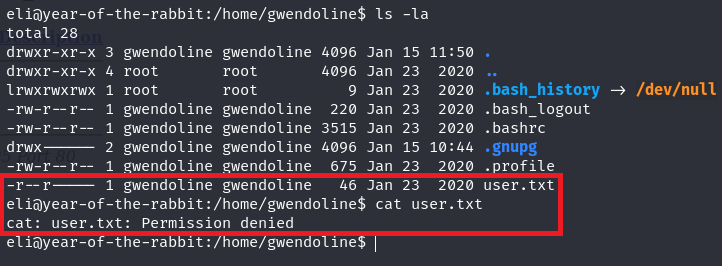
   

## Lateral Movement🧭:

After a while, I decided to search for the "s3cr3t" place root told gwenldoline about, (I preffer to first take a look on the maching by myself),
 
and I run a search:
  
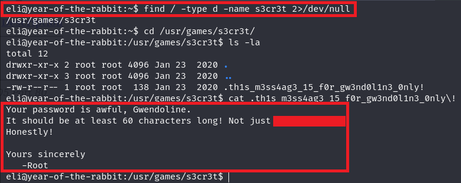
   

Root told Gwendoline that his password is awful and also disclosed his password.
 
I don't care about the the irresponsibility of Root and managed to log in Gwendoline user:
  
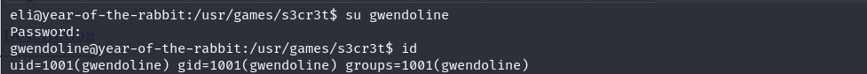
   

First I returned to the flag again and paste it in the Try Hack Me's website.
  
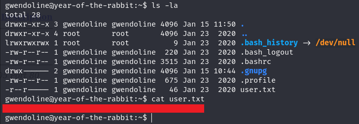
   

We have found the first key!🔑
  

## Privilege Escalation👑:

After all, we want to be root and not a regular user,
 
So I made this short, but I'll explain you this stages step by step:
  
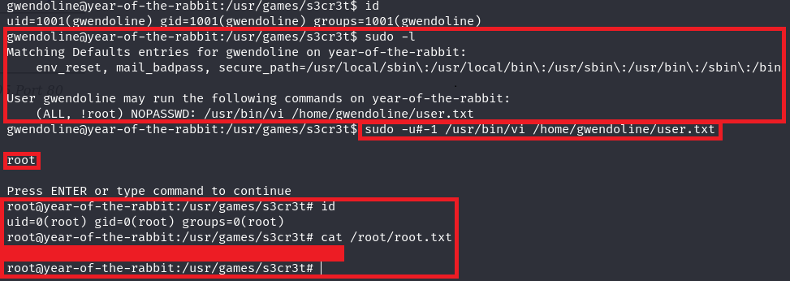
   

I've divided the picture to four different squeres, one after one:
  
1: I run the command "sudo -l", in order to check if my user can run any kind of command with sudo.
 
As you can see we have a different kind of the section "(ALL, !root)", you might seen something like "(ALL, ALL)"
 
That means my user <b>can</b> run the command as another user, but not as root.
 
We can bypass this filter, This filter works with the indexing of users, for example in the /etc/passwd you can see the user id,
 
and as we know, the root's id is 0.
  
2: In this section I run the command with the id of a -1 user, now you probably think how it is even possible?
 
So let me tell you something, it's not.
 
However, when I tried to run it as the -1 user the system tryied to change the value of the user to 0 because this is what happening when
 
the system trying to do so.
  

3: When I run the command, I provided with the vim interface, so I checed who am I with the ":!whoami".
 
As you can see, this command returned me that I am root.
 
Then I pressed enter in order to insert another command, so I wrote ":!/bin/bash".
  

4: In the last section, I made sort of a PoC in order to show you that I am root, and then I've checked the content of "/root/root.txt".
  

## Thank you for reading my walkthrough!
